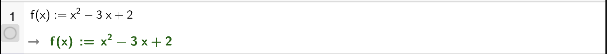
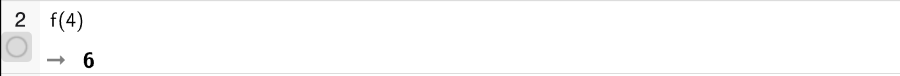
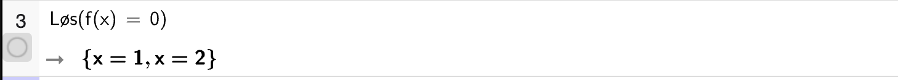
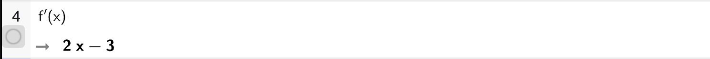
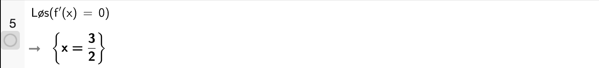
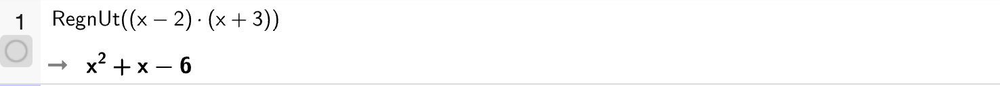

# CAS (Geogebra)

:::::::::::::::{admonition} Oversikt over CAS-funksjoner
---
class: summary, dropdown
---

::::::::::::::{tab-set}
:::::::::::::{tab-item} Løs

Likninger
: 

Ulikheter
: 

Likningssystemer
: 

:::::::::::::

:::::::::::::{tab-item} Funksjoner

Definere funksjon
: 

Funksjonsverdier
: 

Finne nullpunkter
: 

Den deriverte
: 

Finne ekstremalpunkter
: 

:::::::::::::

:::::::::::::{tab-item} Algebra

Faktorisering
: 

Utvide
: 

Polynomdivisjon
: 

:::::::::::::

::::::::::::::

:::::::::::::::

<!-- :::{cas} 800 800
::: -->

:::{ggb} 800 800
---
material_id: mexebm4g   
toolbar: "true"
---
:::

